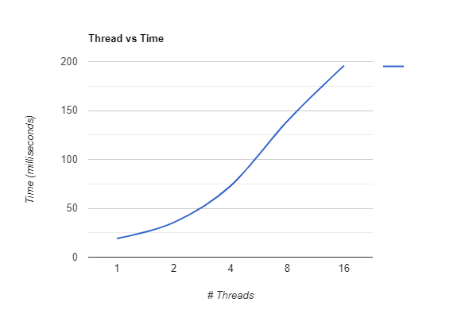

# Manejo de estructuras que usan locks #

## Fuentes de consulta ##
1. Material de clase (Videos y diapostivas).
2. Texto guía [**Operating Systems: Three Easy Pieces**](http://pages.cs.wisc.edu/~remzi/OSTEP/). Para desarrollar este laboratorio se recomienda tener a la mano el capítulo [Lock-based Concurrent Data Structures](http://pages.cs.wisc.edu/~remzi/OSTEP/threads-locks-usage.pdf)

## Ejercicios ##

1. Consulte el uso de la función ```gettimeofday``` para medir el tiempo de ejecución de un programa
   * ¿Cómo se utiliza esta función (muestre un ejemplo)? 
   <br><b>Ver archivo <a href="https://github.com/valcar95/sincronizacion/blob/master/aplicacion/punto1/p1.c">p1.c<a/></b><br>
   * ¿Cuál es el intervalo de tiempo más corto que se puede medir con esta función?
   <br><b>Segun la ejecución del punto anterior el tiempo mínimo es de 0.001 milisegundos</b><br>
2. Consulte cuantas CPUs hay disponibles en el sistema que usted está utilizando. (Pista use el comando lscpu)
<br><br>
2. Desarrolle un programa que utilice un contador concurrente simple. Mida cuánto tiempo lleva incrementar el contador muchas veces a medida que aumenta el número de hilos (1, 2, 4, 8 y 16). Para tal fin, siga las instrucciones que aparecen en el directorio [preciso](./preciso). Una vez complete los pasos continue con el tercer punto.
<br>
<table>
<thead>
<tr>
<th># de hilos</th>
<th>Valor logrado</th>
<th>Duración</th>
</tr>
</thead>
<tbody>
<tr>
<td>1</td>
<td>999424</td>
<td>19.083ms</td>
</tr>
<tr>
<td>2</td>
<td>1998848</td>
<td>35.474ms</td>
</tr>
<tr>
<td>4</td>
<td>3997696</td>
<td>72.793ms</td>
</tr>
<tr>
<td>8</td>
<td>7999488</td>
<td>139.119ms</td>
</tr>
<tr>
<td>16</td>
<td>10997760</td>
<td>195.919ms</td>
</tr>
</tbody>
</table>
<br>
3. Desarrolle una versión del contador aproximado (*sloppy counter*) y mida su desempeño a medida que se varía el número de hilos. En este caso, solo maneje un umbral de S = 1024 variando el número de hilos (1, 2, 4, 8 y 16). Las intrucciones para ello se encuentran en el directorio [aproximado](./aproximado).
4. Grafique los resultados obtenidos de las pruebas recopiladas (en las tablas) para el **número de hilos .vs. el tiempo (en segundos)**, estas siguen la tendencia de la figura **29.5** del libro (la cual se muestra a continuación):


 

   * ¿Los valores que usted obtuvo siguen una tendencia como la que se muestra en el texto guía (mostrada anteriormente)?: <b>Si, como se puede ver en el gáfico adjunto, entre más húmero de hilos mayor es el tiempo</b>
   * ¿Cuántas CPUs hay disponibles en el sistema que usted está utilizando?: <b>8 CPUs</b>  
   * ¿Este número afecta de alguna manera sus mediciones?: <b>No, ya que al intentar con valores diferentes el comportamiento es el mismo</b>

5. Mejore el archivo [test_aproximate_mejorado_counter.c](./aproximado_mejorado/test_aproximate_mejorado_counter.c) (el cual se encuentra en el directorio [aproximado_mejorado](./aproximado_mejorado)) de tal modo que, además de permitir modificar el numero de hilos y el valor máximo del contador a emplear, permita modificar también el umbral o factor de apromación (S), para esto se puede basar en el ejercicio 3. De este modo los parametros serán:
   * Umbral: ```APPROXIMATION_FACTOR```
   * Valor máximo del contador: ```MAXCNT```
   * Número de hilos que serán lanzados: ```NUMTHREADS```
   
Según lo anterior, la forma de pasar argumentos a la aplicación será la siguiente, una vez esté completamente terminada:  

```
./NOMBRE_EJECUTABLE <APPROXIMATION_FACTOR> <MAXCNT> <NUMTHREADS>
```

Luego, ejecute varias veces la aplicación dejando constante el valor máximo del contador en 10000000 y el número de hilos en 4, pero cambiando el valor del umbral a los siguientes valores: 1, 2, 4, 8, 16, 32, 64, 128, 256, 512 y 1024. ¿La gráfica sigue una tendencia similar a la mostrada en la figura **29.6** del texto guía (la cual se muestra a continuación)?


<table>
<thead>
<tr>
<th>Factor de proximidad (S)</th>
<th>Duración</th>
</tr>
</thead>
<tbody>
<tr>

<td>1</td>
<td>127ms</td>
</tr>
<tr>
<td>2</td>
<td>100ms</td>
</tr>
<tr>
<td>4</td>
<td>83ms</td>
</tr>
<tr>
<td>8</td>
<td>77ms</td>
</tr>
<tr>
<td>16</td>
<td>73ms</td>
</tr>
<tr>
<td>32</td>
<td>71ms</td>
</tr>
<tr>
<td>64</td>
<td>72ms</td>
</tr>
<tr>
<td>128</td>
<td>71ms</td>
</tr>
<tr>
<td>256</td>
<td>75ms</td>
</tr>
<tr>
<td>512</td>
<td>70ms</td>
</tr>
<tr>
<td>1024</td>
<td>70ms</td>
</tr>
</tbody>
</table>